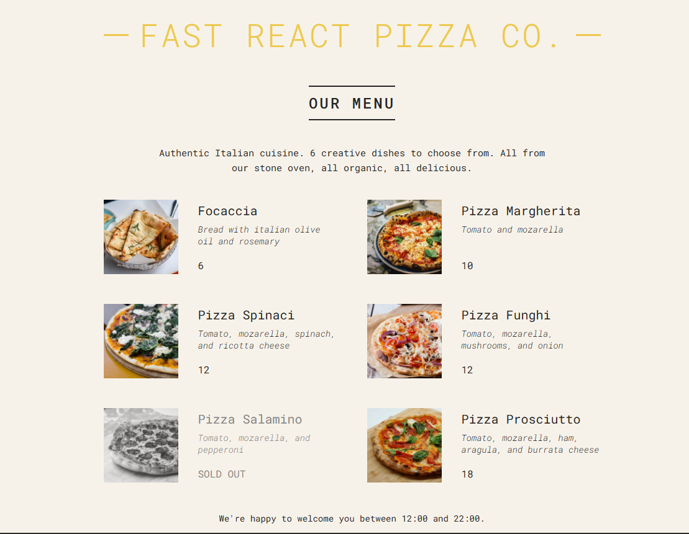

🍕 Fast React Pizza Co.


A simple **React.js practice project** that displays a pizza restaurant menu.  
This project was created to practice **React fundamentals**, including components, props, conditional rendering, and dynamic list rendering.

## 📸 Preview



## 🚀 Features

- Display a list of pizzas dynamically
- Show pizza name, ingredients, price, and image
- Conditional rendering for **sold-out pizzas**
- Dynamic rendering using **JavaScript `.map()`**
- Simple and clean UI using CSS
- Store open / close status based on current time

## 🧠 Concepts Practiced

This project focuses on learning important React concepts:

- React Components
- Props
- Conditional Rendering
- Rendering Lists with `.map()`
- JSX Syntax
- Basic Component Structure
- Simple State Logic (open/close time)

## 🏗️ Project Structure

```
📦 PIZZA-MENU
 ┣ 📂 node_modules
 ┣ 📂 public
 ┃ ┣ 📂 pizzas
 ┃ ┃ ┣ 📜 focaccia.jpg
 ┃ ┃ ┣ 📜 funghi.jpg
 ┃ ┃ ┣ 📜 margherita.jpg
 ┃ ┃ ┣ 📜 prosciutto.jpg
 ┃ ┃ ┣ 📜 salamino.jpg
 ┃ ┃ ┗ 📜 spinaci.jpg
 ┃ ┣ 📜 favicon.ico
 ┃ ┗ 📜 index.html
 ┣ 📂 src
 ┃ ┣ 📜 index.js
 ┃ ┗ 📜 index.css
 ┣ 📂 screenshot
 ┃ ┗ 📜 menu.png
 ┣ 📜 package.json
 ┗ 📜 README.md
```

## 🍕 Example Pizza Data

```javascript
{
  name: "Pizza Margherita",
  ingredients: "Tomato and mozzarella",
  price: 10,
  photoName: "pizzas/margherita.jpg",
  soldOut: false
}

Each pizza is rendered dynamically using:

pizzaData.map((pizza) => (
  <Pizza pizzaObj={pizza} key={pizza.name} />
))
```
## ⏰ Opening Hours Logic
```
The restaurant automatically checks if it is open:

const hour = new Date().getHours();
const openHour = 12;
const closeHour = 22;
const isOpen = hour >= openHour && hour <= closeHour;

If open, users can place an order.
If closed, a message will appear.
```

## 🎯 What I Learned

| Concept | Implementation |
|---------|---------------|
| Props | Passing `pizzaObj` to Pizza component |
| Conditional Rendering | `sold-out` class, ternary operators |
| List Mapping | `pizzaData.map()` with unique keys |
| Component Structure | App → Header, Menu, Footer |
| Dynamic Styling | Conditional CSS classes |
| Real-time Data | Restaurant open/close based on current hour |

## 🛠️ Technologies Used

| Technology | Badge | Description |
|------------|-------|-------------|
| React.js |  | UI library for component-based architecture |
| Create React App |  | Bootstrapped with CRA for zero-config setup |
| JavaScript (ES6+) |  | Modern JS features like arrow functions, map, ternary |
| HTML5 |  | Semantic markup structure |
| CSS3 |  | Styling with modern CSS features |
| Google Fonts |  | Roboto Mono for beautiful typography |

## 📦 Installation
```
Clone the repository:

git clone https://github.com/ranggautama47/menu_pizzas.git

Go to the project folder:

cd menu_pizzas

Install dependencies:

npm install

Run the project:

npm start

The application will run at:

http://localhost:3000
```
## 🎯 Learning Purpose

This project was built as part of my React learning journey to understand how to structure components and render dynamic content in React.


## 👨‍💻 Author

**Rangga Utama**  

[](https://github.com/ranggautama47)

## ⭐ Show Your Support

If this project helped you understand React props & state better, please give it a ⭐ — it motivates me to create more learning resources!

## Happy Coding! 🚀